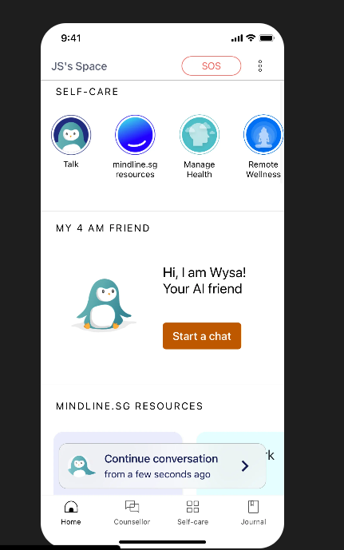
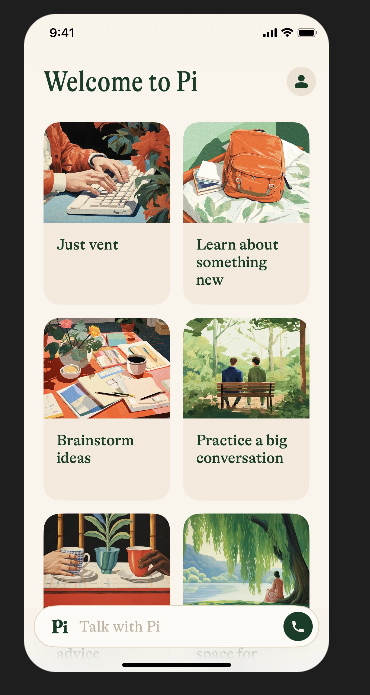
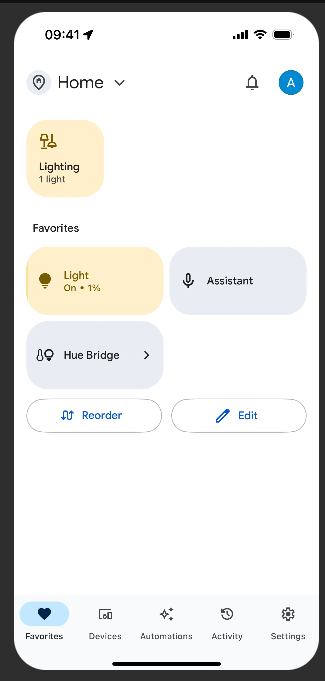

# 🧠 Mental Health Chatbot with Games Corner and journalling center🎮
A compassionate AI-powered chatbot designed to support users facing mental health challenges. It provides empathetic conversations, mood tracking, journal and a Games Corner with interactive activities to help users cope with distress.
Featured Topics: Articles on managing anxiety, overcoming procrastination, plant therapy, mindfulness, sleep hygiene, and health trends.

Interactive Tools: Sections for chat interactions, games, journaling, and mood tracking to engage users in their wellness journey.

# ✨ Features
✅ AI Chatbot for Mental Health – Offers supportive conversations, coping strategies, and self-care advice.
✅ Games Corner – Includes puzzles, memory games, breath exercises, and creative activities to reduce stress.
✅ Mood Tracking – Users can log emotions and track mental health trends.
✅ Journal – Users can journal their feelings regularly.
✅ Emergency Support – Redirects users to professional help when needed.
✅ Privacy & Security – Ensures anonymous chat and secure data storage.
✅ Dark Mode 
✅ Loader
learn something then copy paste to journal.
it is not a licenced professional.

# 🛠️ Tech Stack
Frontend: Next.js, Tailwind CSS, React
Backend: Node.js, Express, MongoDB / PostgreSQL
Auth:Next-auth
AI Engine: Hugging face
Game Framework: Phaser.js, React Canvas
Security: SSL/TLS, OAuth 2.0, JWT

# 💻 Development Roadmap
1. Develop AI Chatbot with Hugging face
2. Implement Games Corner with Phaser.js and React Canvas
3. Integrate Mood Tracking and Journal features
4. Set up Emergency Support and redirect to professional help
5. Implement Privacy & Security measures
6. Conduct user testing and feedback
7. Launch and maintain the platform
8. Improve chatbot responses with NLP tuning
9. Add more engaging games
10. Implement daily affirmations & journaling

# 👥 Target Audience
Individuals facing mental health challenges
Mental health professionals and organizations
Schools and universities for student support

# 💸 Revenue Stream
Subscription
take from t3
Partnership revenue
Grants and funding from mental health organizations
Donations from users
Sponsored content from relevant businesses
Affiliate marketing
Data analytics and insights for mental health research
Co-branded products and services
Training and workshops for professionals
Online courses and educational resources
Merchandise and apparel
Licensing and royalties
Sponsored events and webinars
Co-branded events and conferences

# 📈 Growth Strategy
1. Develop strategic partnerships with mental health organizations
2. Leverage social media and online advertising
3. Collaborate with influencers and content creators
4. Host webinars and workshops on mental health topics
5. Develop a community forum for users to connect and share
6. Offer exclusive content and resources for premium subscribers
7. Create a referral program for users to invite friends
8. Develop a mobile app for on-the-go access
9. Integrate with popular mental health tracking apps
10. Offer a free trial or demo for new users
11. Develop a loyalty program for repeat customers
12. Host events and conferences on mental health topics
14. Create a newsletter or email list for subscribers
15. Develop a mobile-friendly website for easy access
16. Offer a free resource or guide for new users
17. Develop a customer success team for support and feedback
18. Host a mental health challenge or awareness campaign
19. Develop a mental health-themed merchandise line
20. Offer a free consultation or coaching session for new users
21. Develop a mental health-focused online course or certification program
22. Host a mental health-focused conference or summit
23. Develop a mental health-themed podcast or YouTube and tiktok series(animated)
24. Create a mental health-focused community or forum
25. Offer a free mental health assessment or quiz
26. Develop a mental health-focused mobile app
27. Host a mental health-focused webinar or workshop
28. Develop a mental health-focused online community or forum
29. Offer a free mental health resource or guide

# 1. Wellness Product & Service Affiliates
Partner with therapy platforms, meditation apps, or self-care brands (like Headspace, BetterHelp, or Calm).
Show personalized recommendations in the AI chat or journal section.
Example: If a user journals about stress, the app can suggest a stress-relief product with an affiliate link.
How to Implement:

Use context-aware suggestions (via AI chat or journal insights).
Embed affiliate links subtly in responses (e.g., “You might find this mindfulness app helpful”).
# 2. Book & Course Recommendations
Suggest self-help books, therapy guides, or online mental health courses via Amazon, Udemy, or Coursera affiliate programs.
Example: If a user plays a cognitive therapy game, recommend a book on CBT (Cognitive Behavioral Therapy).
Where to Display:
✅ AI chat suggestions
✅ "Recommended Reads" section in the journal
✅ A separate resource hub inside the app

# 3. Affiliate Partnerships with Therapy Services
Offer discounts for therapy platforms like BetterHelp or Talkspace using referral links.
Users who sign up through your link can get a discount, and you earn a commission.
Best Placement:

After AI chat sessions (e.g., “Would you like to speak with a professional?”)
In the journal insights section
In the game’s progress tracking, as a tip
# 4. Wellness & Self-Care Product Affiliates
Partner with brands offering supplements, aromatherapy, sleep aids, and wellness gadgets (e.g., weighted blankets, essential oils).
Suggest these as part of a mental wellness routine.
Integration Idea:
🛒 A small "Wellness Shop" inside the app with trusted recommendations.
💡 AI chatbot suggests a product when users mention sleep issues, anxiety, or focus problems.

# 5. Gamification with Affiliate Rewards
Users earn points by journaling or playing the mental health game.
Points can be redeemed for discounts on partner products/services.
Example: “Earn 100 points and get 10% off a mindfulness course!”
How It Works:

Track user engagement.
Integrate with partners who offer discount codes.
Display deals in a “Rewards” or “Achievements” section.
Technical Implementation Ideas
🔹 Use dynamic links that change based on user behavior.
🔹 Track referrals using UTM links stored in MongoDB.
🔹 Display personalized suggestions based on journal entries & chat topics.

Would you like help with the backend logic or UI design for this? 🚀

# changes
history chat
chati talk to 
search the web function
tablet ui
mobile ui

# tommorow
games corner
pymetric games
log in sign up button
potrait ipad
placeholder pictures
log in and sign up page better ui-two column
user session
dark mode
perfomance vercel tweaks
history and chats and journal auth
database double fix
brainstorm ideas
learn something new

shamiri instagram post integration
terms and conditions.
back to auth
ai generated avatar
database connect

